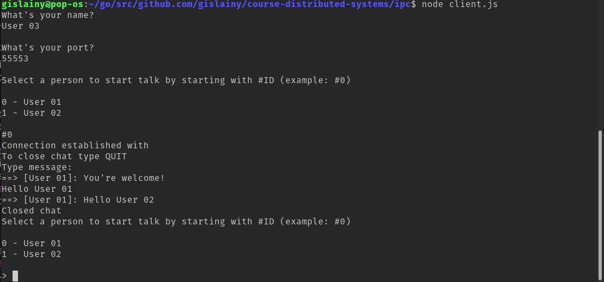

# IPC

Esse projeto foi feito utilizando Node. 

## Descrição do problema
### Aplicação Cliente.  
- Registrar-se no Servidor informando: identificador do usuário (e.g., e-mail), IP e Porta utilizados para receber mensagens de outros clientes;  
- Procurar o identificador de um outro usuário no servidor quando desejar estabelecer uma comunicação;  
- Usar TCP para se comunicar com o servidor e UDP com outros clientes.  
### Aplicação Servidor.  
- Autenticar usuário requisitante  
- Armazenar informações de registro dos clientes em uma tabela  
- Atender requisições dos clientes que desejam obter informações de outros clientes  
- Usar TCP para se comunicar com os clientes

## Forma de uso

### Servidor

Para iniciar o processo servidor, basta:

```
$ node server.js
```

### Cliente

Para iniciar um processo cliente, basta: 
```
$ node client.js
```

## Exemplo

Inicie o servidor, abaixo um exemplo de como ele ficará:


Depois em outros terminais conectes os clientes. Nesse exemplo, utilizamos 3 clientes, sendo `User 01` e `User 03` se comunicando e o `User 03` tentando abrir uma conexão com usuários já ocupado. No final, é fechado a conexão entre esses dois clientes.

### User 01

### User 02

### User 03
