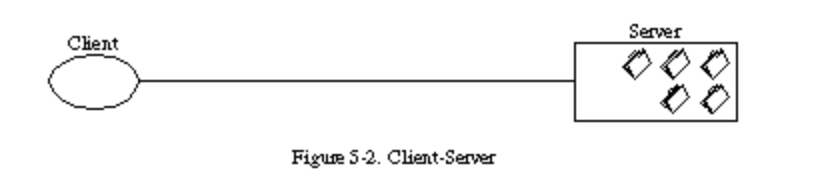

# Arquitetura REST

Created: Mar 23, 2021 11:49 AM
Reviewed: No

## Quem inventou

Criado por Roy T. Fielding em sua tese de Ph.D. em 2000.

[Architectural Styles and the Design of Network-based Software Architectures](https://www.ics.uci.edu/~fielding/pubs/dissertation/top.htm)

## O que é?

REST é a abreviatura de Representational State Transfer, que em português significa “Transferência de Estado Representacional”. REST é uma de **arquitetura de software**, que possui algumas boas práticas, definidas por Roy T. Fielding, para criação de aplicações web

**REST não é necessariamente um protocolo de comunicação.**

RESTful seria, então, a API que está de acordo com todas as restrições definidas por Roy.

## Restrições

[Representational State Transfer (REST)](https://www.ics.uci.edu/~fielding/pubs/dissertation/rest_arch_style.htm)

### Client-Server

A separação de interesses é o princípio por trás das restrições cliente-servidor. Ao separar as questões da interface do usuário das questões de armazenamento de dados, melhoramos a portabilidade da interface do usuário em várias plataformas e melhoramos a escalabilidade simplificando os componentes do servidor.

### Stateless

A comunicação deve ser feita sem estador por natureza, de modo que cada solicitação do cliente deve conter todas as informações necessárias e não pode tirar proveito de nenhuma contexto armazenado no servidor. 

O estado da sessão é mantido inteiramente no cliente. Essa restrição induz as propriedades de visibilidade, confiabilidade e escalabilidade.

### Cache

As restrições de cache exigem que os dados em uma resposta a uma solicitação sejam implicitamente ou explicitamente rotulados como armazenáveis ou não armazenáveis em cache. Se uma resposta puder ser armazenada em cache, o cache do cliente terá o direito de reutilizar os dados de resposta para solicitações equivalentes posteriores.

### Uniform interface

[RESTful: Sua API se encaixa nesse padrão? | Geek Blog |](https://blog.geekhunter.com.br/sua-api-nao-e-restful-entenda-por-que)

Alcançar uma interface uniforme significa atingir quatro critérios:

- **Resource-based**: Em contraposição ao comum RPC, REST tenta lidar com recursos invés de métodos. Caso você esteja criando um post chamando */posts/create?title=lorem* você não está seguindo o padrão **REST**, devido ao tratamento de métodos na url. Nesse cenário, o ideal seria fazer uma chamada **POST** para a coleção de */posts*.
- **Manipulation of resources through representations**: O cliente acessa os recursos através de uma representação (JSON, XML, etc.), que contenha informação suficiente para manipular este no servidor, desde que tenha permissão pra isso.
- **Self-descriptive Messages:** As respostas são auto-descritivas, incluindo informação suficiente para que o cliente saiba como utilizá-las. Usando HTTP, por exemplo, é necessário uma propriedade Content-Type incluída no cabeçalho para descrever que tipo de representação é utilizada.
- Hypermedia as the engine of application state (**HATEOAS**).

### Layered system

Um sistema em camadas é organizado hierarquicamente, cada camada fornecendo serviços para a camada acima e usando serviços da camada abaixo dela. Embora o sistema em camadas seja considerado um estilo "puro", seu uso em sistemas baseados em rede é limitado à sua combinação com o estilo cliente-servidor para fornecer cliente-servidor em camadas.

As camadas podem ser usadas para encapsular serviços legados e proteger novos serviços de clientes legados, simplificando os componentes ao mover a funcionalidade raramente usada para um intermediário compartilhado.

A principal desvantagem dos sistemas em camadas é que eles adicionam overhead e latência ao processamento de dados, reduzindo o desempenho percebido pelo usuário

### Code-On-Demand (opcional)

No estilo code-on-demand, um componente cliente tem acesso a um conjunto de recursos, mas não o know-how de como processá-los. Ele envia uma solicitação a um servidor remoto pelo código que representa esse know-how, recebe esse código e o executa localmente.

O REST permite que a funcionalidade do cliente seja estendida por meio do download e da execução de código na forma de miniaplicativos ou scripts.

### Richardson Maturity Model

[Richardson Maturity Model](https://martinfowler.com/articles/richardsonMaturityModel.html)

O modelo possui 4 níveis de maturidade (sendo 0 uma API que não atenda nenhuma das regras), os outros 3 são:

1. **Recursos**: A partir do momento em que seja possível fazer requisições de diferentes recursos em diferentes *endpoints*. Sem a necessidade dos chamados *query parameters.*
2. **Verbos HTTP**: Aqui, os diferentes métodos **HTTP** são colocados em prática, em contraposição ao uso quase exclusivo do **POST** no protocolo **SOAP**. Além disso, cada verbo possui sua utilidade específica: **PUT** para atualizar, **DELETE** para excluir, **GET** para adquirir e **POST** para criar. Em alguns casos o **PATCH** também é utilizado.
3. **Hypermedia**: Os recursos passam a possuir links para recursos relacionados, além de links para realizar ações em cima dessas coleções, a partir desse ponto, a API se auto-documenta e possibilita a funcionalidade de descoberta.

[Representational State Transfer (REST)](https://www.notion.so/Representational-State-Transfer-REST-aa31acbb5942472eb2205fd964ec740d)

## HTTP não é RPC

As pessoas freqüentemente se referem erroneamente ao HTTP como um mecanismo de chamada de procedimento remoto (RPC)  simplesmente porque envolve solicitações e respostas.

O que distingue o HTTP do RPC não é a sintaxe.

O que torna o HTTP significativamente diferente do RPC é que as **solicitações são direcionadas aos recursos usando uma interface genérica com semântica padrão que pode ser interpretada por intermediários quase tão bem quanto pelas máquinas que originam os serviços**. O resultado é um aplicativo que permite camadas de transformação e indireção que são independentes da origem da informação, o que é muito útil para um sistema de informação anarquicamente escalável, multiorganizacional e em escala da Internet. Os mecanismos RPC, em contraste, são definidos em termos de APIs de linguagem, não de aplicativos baseados em rede.

## HTTP não é um protocolo de transporte

É um protocolo de transferência no qual as mensagens refletem a semântica da arquitetura da Web, realizando ações sobre os recursos por meio da transferência e manipulação de representações desses recursos. É possível obter uma ampla gama de funcionalidades usando essa interface muito simples, mas seguir a interface é necessário para que a semântica HTTP permaneça visível para os intermediários.